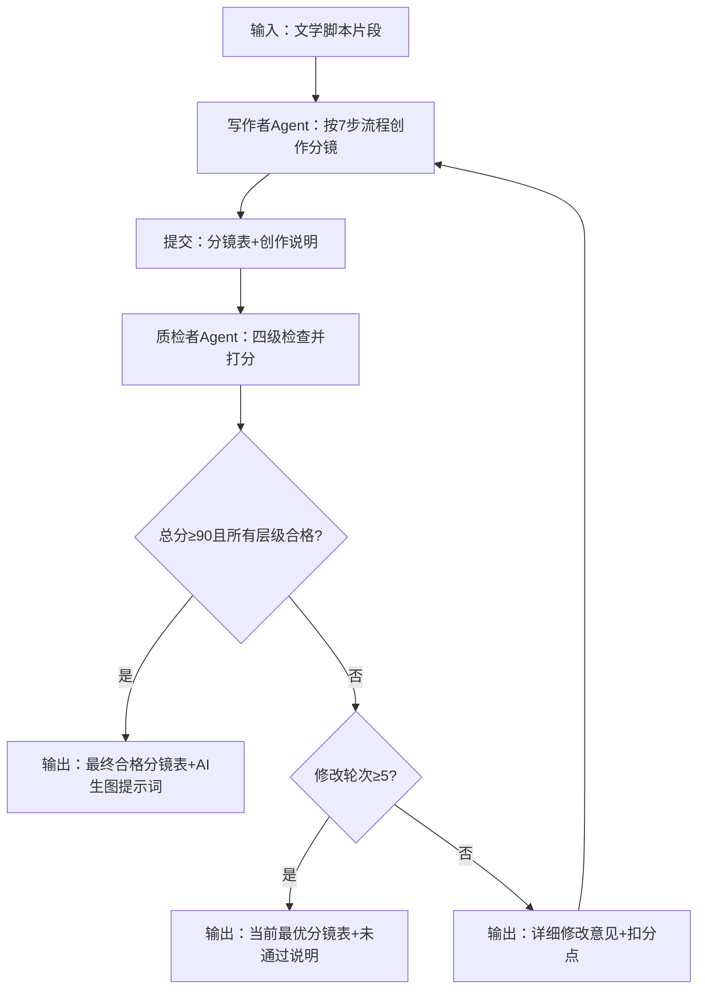

# 双Agent闭环工作流程

## 每轮修改要求

1. 写作者必须针对质检者每一个扣分点进行修改
2. 提交修改稿时附带「修改说明」，逐条说明修改了什么、为什么
3. 质检者只检查上一轮问题是否解决，不引入新问题（除非修改导致新错误）

## 系统终止条件

1. **最优终止**：总分≥90且所有层级过关 → 输出最终分镜表 + AI生图提示词
2. **强制终止**：修改轮次≥5轮仍未通过 → 输出得分最高版本 + 未通过说明
3. **手动终止**：用户可随时手动终止，选当前版本为最终版本
