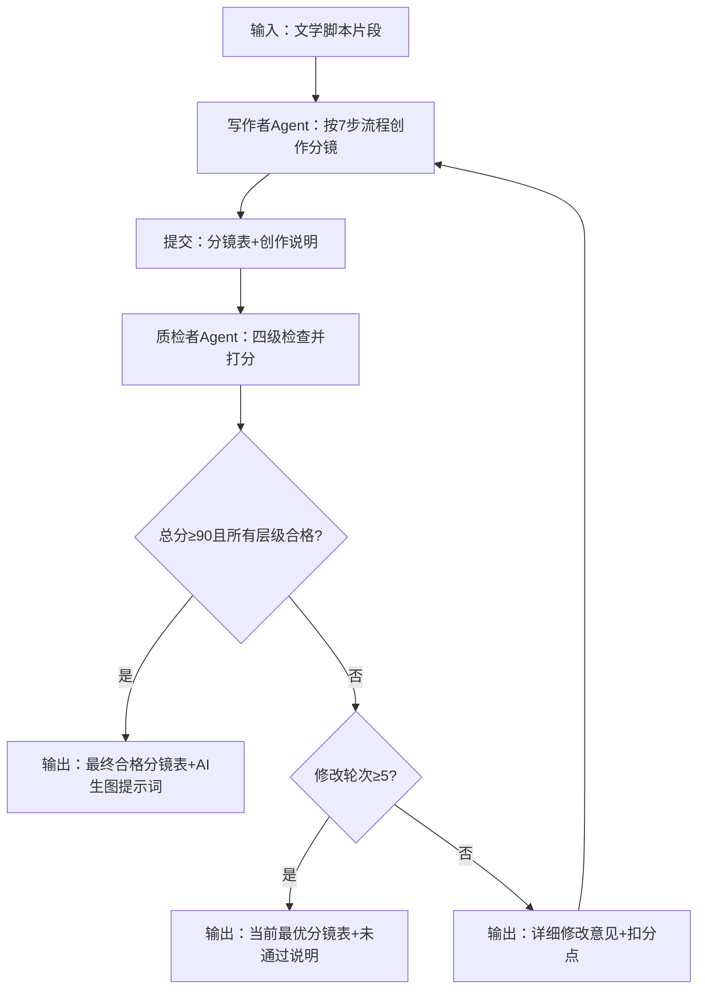

# Toffee Family 分镜头脚本 Skill

> **核心定义**：不是"把文字变成画"，而是基于人类大脑的生理与心理感知硬规律，将脚本的线性叙事意图，转化为一条完全可控的一维观众注意力流与情绪流。

> **一句话快速上手**：先定目标再选镜，跟着大脑走规律。一个镜头一个叙事目标，不等于一个微动作。连续同机位先合并，声音比画更重要，反应永远胜动作。

---

## 一、底层逻辑（第一性原理基石）

### 两个本质的范式转换

| 事物 | 本质 | 核心缺陷 |
|------|------|----------|
| 文学脚本 | 用文字编码的抽象叙事意图 | 依赖读者脑补，观众可自由分配注意力 |
| 分镜头 | 用视觉语言解码的可执行感知指令 | 剥夺观众注意力选择权，强制按导演设计的路径接收信息 |

### 绝对决策优先级（下层服从上层，不可颠倒）

**单一核心叙事目标 > 人类大脑感知硬规律 > 段落戏剧功能与整体节奏 > 人物视角与潜台词 > 制作条件与媒介特性**

---

## 二、双Agent角色与职责边界

### 🎬 写作者Agent（执行端）

**核心职责**：严格按照"第一性原理分镜决策法7步流程"创作分镜，输出标准化分镜表

**输出要求**：
1. 每个镜头必须标注唯一核心目标
2. 所有元素（景别/角度/运动/时长/声音）必须完整
3. 文字描述必须具体、可执行，无抽象形容词
4. 提交时附带「创作说明」，说明整体叙事逻辑和关键情绪节点

### 🧐 质检者Agent（独立端）

**核心职责**：完全独立于写作者，只负责客观评分和提出修改意见，不参与创作

**工作原则**：
1. 只基于"剧本表达意图""观众感知规律""AI生图规范"三个客观标准打分
2. 所有扣分必须给出具体原因和可执行的修改建议
3. 不接受任何"艺术感觉""个人风格"类的辩解
4. 严格执行终止条件：总分≥90分 或 修改轮次≥5轮

---

## 三、标准7步操作流程

### 第1步：全局拆解，定段落核心功能

**输入**：完整文学脚本片段
**输出**：1句话段落功能 + 情绪曲线 + 3个以内关键转折点

**操作**：
- 问自己：这个段落唯一的戏剧任务是什么？（建立场景/制造悬念/推动冲突/释放情绪）
- 画出情绪起伏曲线，标记所有"情绪急转弯"的节点
- 所有转折点必须用单独镜头强化，绝对不能合并

### 第2步：选择全局叙事视角

**输出**：明确的视角策略（主观/客观/过肩/上帝）

**核心原则**：
- **悬疑/惊悚/代入感强的场景**：全程主角主观视角为主，绝对禁用"观众知道但主角不知道"的上帝视角
- **客观叙事/群戏场景**：多用平视固定镜头，保持中立
- **潜台词传递**：用过肩镜头切换视角，暗示人物关系
- **儿童剧双人对话**：默认使用儿童眼高、平视、双人中景、固定机位，让关系和动作在同一画面内清楚发生；除非视线信息或权力关系发生变化，不做正反打式过肩切换

### 第3步：拆分镜头，定「单一核心目标」（最关键一步）

**输出**：每个镜头对应唯一的1句话核心目标

**铁律**：一个镜头只能服务一个核心叙事目标，任何与目标无关的信息全部砍掉。一个核心目标可以包含同一机位内顺序发生的多个动作节拍，不要把每个微动作误拆成独立镜头。

- ❌ 错误："展现公寓布局+表现主角疲惫"
- ✅ 正确："让观众感受到主角的极度疲惫"

**合并判定**：相邻镜头若同时满足“同一场景、同一景别、同一角度、同一视线方向、时间连续、核心目标一致”，优先合并为一个连续镜头，并在画面栏按先后顺序调度动作。任一条件变化，或出现新的信息揭示/情绪转折/关键道具，才保留切镜。

### 第4步：匹配元素，基于感知规律选参数

**输出**：景别 + 角度 + 运动 + 时长的最优组合

**决策对照表**：

| 元素 | 本质作用 | 决策依据 |
|------|----------|----------|
| 景别 | 决定观众与主体的心理距离 | 情绪越强，景别越近；交代环境用全景/远景 |
| 角度 | 决定观众对主体的主观态度 | 仰视=强大/压迫；俯视=弱小/无助；倾斜=不安 |
| 镜头运动 | 引导观众视线移动 | 推=聚焦；拉=揭示；慢摇=悬念积累；固定=客观 |
| 时长 | 分配注意力时间权重 | 1-2s=简单信息；3-5s=情绪反应；5s+=深度代入 |

**儿童剧景别边界**：
- 全景只用于首次交代环境、人物空间关系或重新确认方位；普通动作不要为了“好看”退到全景
- 双人对话优先中景平视固定机位，减少过肩视角来回切换
- 特写只用于必要的情绪峰值、关键线索、关键食物/道具或认知变化；普通台词不滥用特写
- 缓慢节奏的开场环境镜头默认给足约5秒，让低龄观众完成空间识别；后续镜头时长再随信息复杂度调整

### 第5步：串联节奏，定剪辑点

**输出**：完整的镜头顺序与剪辑时机

**核心规则**：
- 剪辑点永远对齐观众的视线落点或动作峰值
- 情绪转折处用"硬切"，制造突兀感
- 紧张段落：镜头越来越短，景别越来越近
- 情绪释放段落：镜头越来越长，运动越来越慢
- 同景别、同角度、同机位持续发生的剧情不要机械拆碎；若无新的注意力目标，就让动作在一个镜头内完成
- 合并长镜头必须写清动作先后和最终画面状态，避免多名角色同时争夺儿童注意力
- 时间发生跳跃时，前后镜头之间必须提供可感知证据；优先组合使用环境变化（树影/光线/钟表）、状态变化（吃空的餐盒/完成的任务）和声音桥接（脚步远去/聊天声延续）中的至少两类

### 第6步：设计声音，70%的情绪来自声音

**优先级**：音效 > 静音 > 音乐

**核心技巧**：
- 悬念场景：用"声音的突然消失"代替恐怖音效
- 情绪同步：让观众的心跳与镜头中的心跳声同频
- 绝对禁用：满铺的背景音乐，会毁掉所有悬念

### 第7步：无情做减法

**检查清单**：
- 删掉所有不能服务于核心目标的镜头
- 删掉所有多余的环境展示和人物外貌描写
- 删掉所有俗套的面部表情镜头，改用生理反应（后颈、拳头、呼吸）
- 删掉所有不必要的音乐和音效

### 儿童剧镜头合并与拆分速查

| 情况 | 处理 | 原因 |
|------|------|------|
| 同景别、同角度、同机位、同一核心目标连续发生 | 合并，并按时间顺序写动作 | 避免碎切，降低低龄观众的认知切换成本 |
| 对话双方保持同一空间关系 | 双人中景平视固定拍摄 | 同时看清说话者、倾听者和道具 |
| 新线索首次出现、情绪明显转折、关键道具揭示 | 单独切镜，可按需要使用近景/特写 | 把唯一注意力交给关键变化 |
| 只是在同一动作中换了人物反应 | 先尝试同框调度；只有反应无法读清时才切 | 反应重要，但不等于必须切镜 |
| 时间跳跃但地点不变 | 加入至少两类时间证据再切 | 防止观众误解为动作立即连续发生 |
| 缓慢开场需要交代环境 | 全景约5秒，运动缓慢并稳定落到叙事入口 | 给儿童足够的空间识别时间 |

**生理反应语义检查**：不要凭印象写身体反应。发现目标、惊喜或兴趣增强时，常用“瞳孔放大、耳朵竖起、身体前倾”；强光、警觉收束或聚焦细节才可能使用“瞳孔收紧”。若反应方向与剧情刺激不一致，必须改正。

---

## 四、核心工具库：大脑感知硬规律速查

### 1. 视觉注意力规律
- 人脸优先 > 运动优先 > 对比度优先 > 中心优先
- 人类会自动忽略暗部信息，把视线集中在亮部

### 2. 时间感知规律
- **0.1-0.3s**：闪回/惊吓，看不清内容
- **1-2s**：快节奏信息传递
- **3-5s**：标准镜头时长，产生初步情绪
- **5s以上**：深度情绪代入与思考

### 3. 情绪传递规律
- 手持抖动 = 不安/混乱/真实
- 慢镜头 = 情绪放大
- 留白 = 无限想象空间
- 反应镜头永远比动作本身更有情绪冲击力

---

## 五、四级量化评分体系（总分100分）

| 检查层级 | 权重 | 核心检查内容 | 合格线 |
|----------|------|-------------|--------|
| 整体分镜检查 | 30分 | 叙事逻辑、情绪曲线、节奏控制、视角一致性 | 24分 |
| 段落分镜检查 | 30分 | 段落戏剧功能、转折点强化、镜头衔接流畅度 | 24分 |
| 单镜头检查 | 30分 | 单一核心目标、元素匹配度、感知规律运用 | 24分 |
| AI生图规范检查 | 10分 | 描述清晰度、无歧义、可生成性 | 8分 |

**打回标准**：任意层级得分低于该层级合格线，或总分低于80分，直接打回重写
**通过标准**：总分≥90分，且所有层级得分均达到合格线

### 1. 整体分镜检查（30分）

| 检查项 | 分值 | 扣分标准 |
|--------|------|----------|
| 叙事逻辑完整性 | 10分 | 缺少关键情节节点，每处扣5分；逻辑断裂，扣10分 |
| 情绪曲线合理性 | 8分 | 情绪起伏不符合剧本意图，扣5分；没有铺垫直接高潮，扣8分 |
| 整体节奏控制 | 7分 | 节奏拖沓或过快，扣4分；没有张弛变化，扣7分 |
| 叙事视角一致性 | 5分 | 视角混乱，随意切换上帝视角，扣5分 |

### 2. 段落分镜检查（30分）

| 检查项 | 分值 | 扣分标准 |
|--------|------|----------|
| 段落核心功能明确 | 10分 | 段落戏剧功能不清晰，扣10分 |
| 关键转折点强化 | 8分 | 情绪转折点没有用单独镜头强化，每处扣4分 |
| 镜头衔接流畅度 | 7分 | 剪辑点不符合视觉习惯，每处扣3分；跳轴，扣7分；时间跳跃缺少可感知证据，扣3分 |
| 信息密度合理 | 5分 | 信息过载或信息不足，扣5分；同机位连续动作被无理由拆碎，每组扣2分 |

### 3. 单镜头检查（30分）

最核心的检查环节，每个镜头单独打分，取平均分

| 检查项 | 分值 | 扣分标准 |
|--------|------|----------|
| 单一核心目标明确 | 12分 | 没有标注核心目标，扣12分；一个镜头有多个目标，扣10分 |
| 元素与目标匹配 | 8分 | 景别/角度/运动/时长选择不能服务于核心目标，每处扣2分 |
| 符合大脑感知规律 | 6分 | 违反视觉注意力/时间感知/情绪传递规律，扣6分 |
| 无多余信息 | 4分 | 包含与核心目标无关的内容，每处扣2分；生理反应方向与剧情刺激相反，扣2分 |

### 4. AI生图规范检查（10分）

| 检查项 | 分值 | 扣分标准 |
|--------|------|----------|
| 描述具体无歧义 | 4分 | 出现"紧张的""悲伤的""美丽的"等抽象形容词，每处扣1分 |
| 包含所有必要生成元素 | 3分 | 缺少景别/角度/光影/色彩中的任意一项，每处扣1分 |
| 无AI无法理解的指令 | 2分 | 出现"慢动作""手持抖动"等AI无法直接生成的动态描述，扣2分 |
| 格式统一 | 1分 | 描述格式混乱，扣1分 |

---

## 六、双Agent闭环工作流程



### 每轮修改要求
1. 写作者必须针对质检者提出的每一个扣分点进行修改
2. 提交修改稿时，必须附带「修改说明」，逐条说明修改了什么、为什么修改
3. 质检者只检查上一轮提出的问题是否解决，不引入新的问题（除非修改导致了新的错误）
4. 涉及镜头合并或拆分时，必须重新核验镜号连续、时码无空档/重叠、总时长不变、分镜表与提示词一一对应

---

## 七、系统终止条件

1. **最优终止**：总分≥90分，且所有层级得分均达到合格线 → 输出最终分镜表 + AI生图提示词
2. **强制终止**：修改轮次达到5轮仍未通过 → 输出当前得分最高的版本 + 未通过说明 + 改进建议
3. **手动终止**：用户可以在任意轮次手动终止流程，选择当前版本作为最终版本

---

## 八、AI生图提示词自动转换规则

### 标准格式
`[景别], [拍摄角度], [光影], [色彩], [画面内容], [风格]`

合并镜头的定帧提示词只描述一个可见瞬间，优先选择关键动作完成后的终态。不要把“先做A、再做B、最后做C”的时间过程塞进同一张定帧图；动态过程保留在分镜表画面栏。

### 禁止出现
慢动作、手持抖动、推/拉/摇/移、情绪形容词、抽象概念

### 情绪转化为视觉元素

| 情绪 | 视觉转化 |
|------|----------|
| 紧张 | 昏暗的光影、高对比度、倾斜的构图 |
| 悲伤 | 冷色调、柔和的漫射光、空旷的构图 |
| 不安 | 手持抖动效果（用"轻微模糊、晃动感"替代）、低饱和度 |
| 希望 | 暖色调、柔光、明亮的背景 |

### 示例

**分镜描述**：大特写，平视，固定，3s，透明玻璃杯的杯口，一缕白色的热气在暖黄色的台灯光下缓缓升起

**AI生图提示词**：大特写，平视角度，暖黄色台灯光影，低对比度，透明玻璃杯的杯口，一缕白色的热气缓缓升起，电影质感，写实风格

---

## 九、专业分镜师自检清单

全部通过才算合格：

1. ✅ 每个镜头都有且只有一个清晰的核心目标
2. ✅ 所有元素的选择都能追溯到"为了传递什么信息/情绪"
3. ✅ 没有任何一个镜头是"凭感觉"选的
4. ✅ 声音栏的详细程度不低于画面栏
5. ✅ 删掉任何一个镜头，都会导致叙事或情绪断裂
6. ✅ 没有任何多余的信息会分散观众的注意力
7. ✅ 同景别、同角度、同机位、同目标的连续剧情已经合并，没有把微动作机械拆镜
8. ✅ 全景只承担环境/方位交代，特写只承担关键情绪、线索或道具强调
9. ✅ 儿童双人对话优先采用儿童眼高中景固定机位，没有无意义的过肩正反打
10. ✅ 所有时间跳跃都有至少两类可感知证据，生理反应方向与刺激语义一致
11. ✅ 镜号、时码、总时长和逐镜提示词数量完全一致；合并后已统一重新编号

---

## 十、常见误区避坑

| 误区 | 真相 |
|------|------|
| 分镜必须画得好 | 分镜的核心是传递信息，火柴人+文字分镜同样有效 |
| 分镜要尽可能还原脚本的所有细节 | 好的分镜永远在拍脚本里没有写的潜台词 |
| 上帝视角能让观众了解更多信息 | 未知的恐惧和悬念，永远比全知更有吸引力 |
| 镜头越多越专业 | 能用一个镜头说清楚的事，绝对不用两个 |
| 一个镜头一件事等于一个动作一镜 | “一件事”指一个核心叙事目标；同机位连续动作应合并并按顺序调度 |
| 对话必须靠过肩正反打保持节奏 | 儿童剧优先同框中景，只有视点或关系发生变化才切换 |
| 时间过去了写在文字里就够 | 观众必须从环境、状态或声音中看到/听到时间证据 |

---

## 十一、输出格式模板

### 分镜表格式

```markdown
## 分镜表

| 镜号 | 时码 | 景别 | 视角角度 | 镜头运动 | 时长 | 画面内容 | 声音 | 核心目标 | 剪辑点 |
|------|------|------|---------|---------|------|---------|------|---------|--------|
| 1 | 00:00-00:05 | 全景 | 儿童眼高平视 | 缓慢横移 | 5s | ... | ... | ... | ... |
```

### 创作说明格式

```markdown
## 创作说明

**段落功能**：一句话说明段落戏剧任务
**情绪曲线**：描述情绪起伏
**视角策略**：说明视角选择原因
**关键转折点**：标记情绪转折位置
```

### 修改说明格式

```markdown
## 修改说明（第N轮）

| 扣分点 | 原问题 | 修改内容 | 修改原因 |
|--------|--------|---------|---------|
| ... | ... | ... | ... |
```

### AI生图提示词输出格式

```markdown
## AI生图提示词

### 镜头1
[景别], [角度], [光影], [色彩], [画面描述], 电影质感, 写实风格
```
